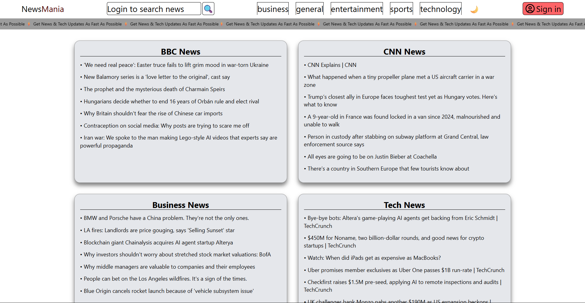

📰 NewsMania – News Aggregator Web Application

NewsMania is a high-performance, full-stack news aggregator that delivers real-time global headlines through a sleek, responsive interface. Built with the MERN stack (MongoDB, Express, React, Node), it features secure JWT-based authentication and restricted premium features like deep-search functionality.

🚀 Features

<ul>
<li>📰 Top Headlines</li>
Displays the latest news headlines from multiple channels.  

<li>📂 Category-Based News</li>
Users can browse news by categories such as Technology, Business, Sports, Entertainment, etc.  

<li>🔍 Gated Search Functionality</li>
An advanced search feature restricted to registered users via backend middleware protection.  

<li>⚡ Real-Time News Fetching</li>
Seamless integration with third-party News APIs to provide the latest breaking news.  

<li>🧠 Dynamic Rendering</li>
DOM-based dynamic rendering updates news content without reloading the page.  

<li>🔐 Secure Membership</li>
Complete authentication system using JSON Web Tokens (JWT) and HttpOnly Cookies to protect user sessions.  

<li>🛡️ Password-Protected Account Actions</li>
High-stakes operations (such as account deletion or profile updates) require secondary password verification using Bcrypt re-authentication to prevent unauthorized changes.  

<li>📱 Fully Responsive Design</li>
A fully responsive design featuring Dark Mode, smooth transitions, and mobile-optimized navigation built with Tailwind CSS.
</ul>

🛠️ Tech Stack
<ul>
<li>Frontend – React.js, Vite, Tailwind CSS, Lucide Icons / svg</li>
<li>Backend – Node.js, Express.js</li>
<li>Database – MongoDB, Mongoose</li>
<li>Auth – JWT (JSON Web Tokens), Cookie-Parser, Bcrypt.js</li>
</ul>

📂 Project Folder

    NEWSMANIA
    ├── news-backend/          # RESTful API Server
    │   ├── src/
    │   │   ├── config/        # Database & Environment configurations
    │   │   ├── controllers/   # Request handlers (Auth, News, Search)
    │   │   ├── middleware/    # Auth guards & Route protection
    │   │   ├── models/        # Database Schemas (User profiles)
    │   │   └── routes/        # API endpoint definitions
    │   └── server.js          # Backend entry point
    ├── src/                   # React Frontend (Vite)
    │   ├── components/        # Reusable UI (Navbar, Content, Modals)
    │   ├── App.jsx            # State management & Routing
    │   └── main.jsx           # Client entry point
    └── .env                   # Sensitive configuration

🛡️ Security & Authentication

NewsMania prioritizes user security by implementing a Stateless Authentication flow:

Encryption: User passwords are encrypted using Bcrypt.js before being stored in MongoDB.

JWT Verification: Upon login, a JWT is generated and stored in a secure HttpOnly cookie.

Route Guarding: The checkToken middleware intercepts requests to sensitive routes (like /search), ensuring only valid, authenticated users can access the data.

## 🖼️ Preview

📄 License

This project is open-source and available under the MIT License.
